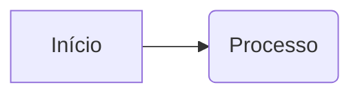

## Modelos e Estatísticas

Primeiramente foi sugerido utilizar o [[#FaceNet]] dado a sua importância e ampla divulgação da sua implementação e sim, é um ótimo modelo que muito provavelmente atingiria todos os objetivos deste trabalho, mas depois de muita pesquisa com apoio do gemini e papers que serão mencionados ao longo do documento, percebeu-se que esse modelo é de 2015 e dado o ano em que este documento está a ser escrito (2025) muito mudou, principalmente no que diz respeito às redes neuronais. 

Para o presente trabalho, utilizar modelos mais recentes não traria melhorias tão significativas dado que as fotos são tiradas de modo frontal, com elevada resolução, sem artefatos e com iluminação suficiente, mas neste trabalho pretende-se evoluir e utilizar modelos que consigam o mínimo de erro na classificação, assim como os utilizados amplamente nos dias de hoje, e que consigam uma boa velocidade de reconhecimento, ou seja, abaixo dos 5s de execução, claro que este tempo depende muito do hardware utilizado.

Uma das fontes utilizadas foi o [paperswithcode.com](http://paperswithcode.com), um site que oferece uma ampla escolha de benchmarks no que diz respeito a algoritmos. Dado que este site foi eliminado no verão de 2025 e agora apenas redireciona para o [huguingfaces.com](https://huggingface.co/papers/trending), utilizou-se o [web.archive.org](https://web.archive.org) e outra foi o paper do [TransFace++](https://kclpure.kcl.ac.uk/ws/portalfiles/portal/354575823/TransFace_TPAMI_final.pdf), um algoritmo focado em reconhecimento facial utilizando transformers publicado em agosto de 2025 que alega ser melhor que qualquer outro algoritmo de reconhecimento facial. Em ambas as fontes já não é utilizado o FaceNet dado à sua baixa qualidade em classificar quando se trata de rostos tapados, em condições de luminosidade baixa e poses laterais. Em ambas apresentam dois excelentes candidatos para este trabalho, o ArcFace lançado em 2019 e o AdaFace lançado em 2022. A razão de não colocar como bom candidato TransFace++ ou outro algoritmo que utilize transformers é devido a sua extrema necessidade de processamento e dados em comparação aos dois mencionados anteriormente.

## FaceNet

[**FaceNet**](https://en.wikipedia.org/wiki/FaceNet#:~:text=FaceNet%20is%20a%20facial%20recognition,of%20researchers%20affiliated%20with%20Google.) é um sistema de reconhecimento facial desenvolvido por Florian Schroff, Dmitry Kalenichenko e James Philbin, um grupo de pesquisadores afiliados a Google. . O sistema foi apresentado pela primeira vez em [2015 IEEE Conferência sobre Visão Computacional e Reconhecimento de Padrões](https://www.cv-foundation.org/openaccess/content_cvpr_2015/papers/Schroff_FaceNet_A_Unified_2015_CVPR_paper.pdf).

### Embeddings

Este algoritmo utiliza o conceito de *embeddings* (vetor de números) para conseguir diferenciar pessoas.

De uma forma superficial:
- Se tirarmos 10 fotos suas (de frente, de lado, rindo, sério), o FaceNet deve gerar quase os **mesmos números** para todas elas.
    
- Se tirarmos uma foto de outra pessoa, os números devem ser **muito diferentes**.

O resultado é que o reconhecimento facial vira um problema de **Geometria**:

- Rostos similares = Pontos próximos no espaço.
    
- Rostos diferentes = Pontos distantes.

### Triplet Loss

Usa um método de treino chamado **Triplet Loss** (Perda de Trio).

Durante o treino, a rede não olha para uma foto de cada vez. Ela olha para **três** fotos simultaneamente:

1. **Ancora (Anchor):** A foto de referência (ex: Foto A do João).
    
2. **Positivo (Positive):** Outra foto da _mesma_ pessoa (ex: Foto B do João).
    
3. **Negativo (Negative):** Uma foto de uma _pessoa diferente_ (ex: Foto da Maria).
    

**O objetivo do treino:** A rede ajusta os seus pesos matemáticos para garantir que a distância entre a **Âncora** e o **Positivo** seja _menor_ que a distância entre a **Âncora** e o **Negativo**.

Ela repete isso milhões de vezes até aprender a ignorar iluminação, pose e idade, focando apenas na identidade.

### MTCNN (Multi-task Cascaded Convolutional Networks)

O FaceNet não tem capacidade de identificar caras por isso se não houver pré processamento estaremos a comparar também o ambiente (não pretendido).

O MTCNN varre a imagem, encontra o quadrado onde está o rosto e, crucialmente, encontra 5 pontos (olhos, nariz, boca).

### Modificar o FaceNet para Classificação

Até agora, estávamos a usar o FaceNet no modo **Metric Learning** (Comparação):

- **Entrada:** Foto.
    
- **Saída:** Vetor de 128 números.
    
- **Decisão:** Calculamos a distância matemática.
    

O que você quer fazer agora é **Classification** (Classificação):

- **Entrada:** Foto.
    
- **Saída:** Probabilidade (Ex: 99% Pedro, 1% João).
    
- **Decisão:** A própria rede diz quem é.

#### 2. A Arquitetura: Como modificar o FaceNet

Para fazer isso, precisamos "operar" o cérebro do FaceNet.

1. **Congelar o "Corpo" (Backbone):** Pegamos no InceptionResnetV1 pré-treinado (vggface2). Não queremos estragar o que ele já sabe sobre o que é uma sobrancelha ou um nariz. Então, "congelamos" esses pesos.
    
2. **Cortar a "Cabeça":** Removemos a última camada que gera os vetores (embeddings).
    
3. **Colocar uma Nova "Cabeça":** Adicionamos uma camada linear simples (Dense/Fully Connected) que tem as **saídas**  (Pedro e João).

|                           | Vantagens                                                          | Desvantagens                                                                         |
| ------------------------- | ------------------------------------------------------------------ | ------------------------------------------------------------------------------------ |
| Classificação (Sua ideia) | Muito preciso com muitas fotos. A resposta é instantânea (0 ou 1). | **Inflexível.** Se entrar uma 3ª pessoa ("Maria"), você tem de re-treinar a rede.    |
| Embeddings (Anterior)     | Flexível. Se entrar a Maria, basta adicionar 1 foto dela ao banco. | Pode ser menos preciso se a iluminação variar muito e não tivermos um bom threshold. |

Decidi n continuar dado o presente no inicio do documento...

